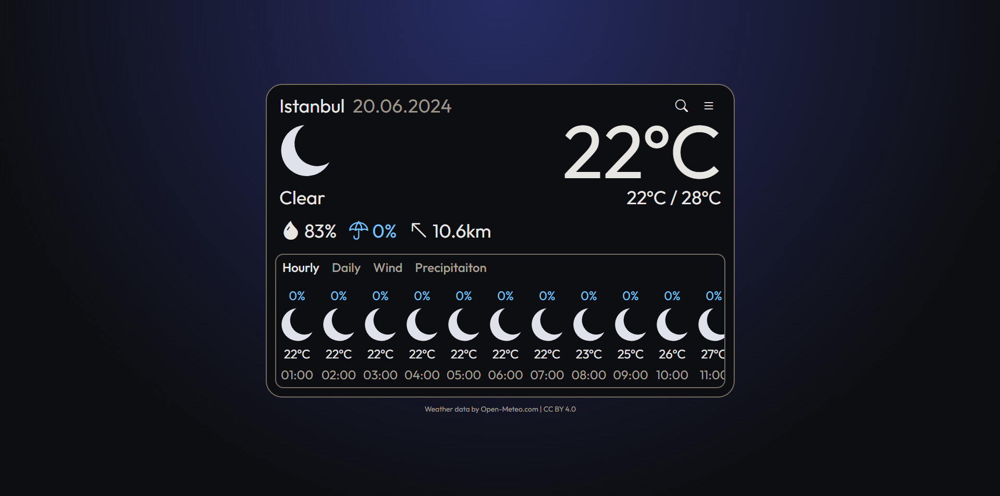

# ReactJS Weather App

[Try it here]("https://astudentinearth.github.io/weather-app")
### Features
- [X] Daily and hourly forecasts  
- [X] Location search  
- [X] Unit switching

### Tech stack
 - React 18
 - TailwindCSS
 - shadcn-ui
 - Vite
 - i18next

## Running locally and testing
Use `npm run dev` to start the development server.  
Use `npm run dev:network` to expose the ports to your network.  
Navigate to `http://localhost:5173` to see the app in your browser.  
Use `npm run test` to run the entire test suite with vitest.

## Localization
Language files are stored as static assets in `public/locales/<language>`  
i18next-react is used to parse the locales and reflect them to the UI.

## Credits
Weather data is provided by [Open-Meteo](https://github.com/open-meteo/open-meteo) under [Attribution International 4.0 (CC BY 4.0)](https://creativecommons.org/licenses/by/4.0/)
