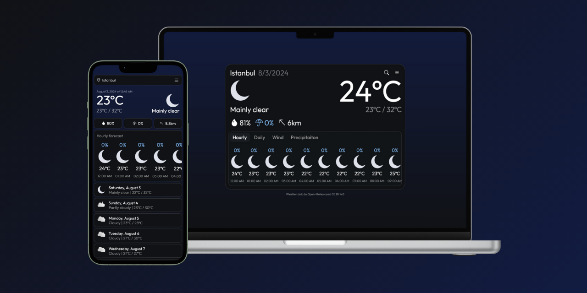

# ReactJS Weather App
 
[Try it live](https://astudentinearth.github.io/weather-app)

### Features
- [X] Hourly forecasts with wind and precipitation details
- [X] 7-day forecasts
- [X] Location search  
- [X] Metric and imperial units
- [X] Geolocation support
- [X] Installable as Progressive Web App
- [X] Turkish and English language support

### Built with
 - React 18
 - Zustand
 - TailwindCSS
 - shadcn-ui
 - vite-pwa
 - i18next
 - Bootstrap icons

# Development
Use `pnpm run dev` to start the development server.  
Use `pnpm run dev:network` to expose the ports to your local network.  
Navigate to `http://localhost:5173/weather-app` to see the app in your browser.  
Use `pnpm run test` to perform unit tests.

## Localization
Language files are stored as static assets in `public/locales/<language>`  
i18next-react is used to parse the locales and reflect them to the UI.

## Credits
Weather data is provided by [Open-Meteo](https://github.com/open-meteo/open-meteo) under [Attribution International 4.0 (CC BY 4.0)](https://creativecommons.org/licenses/by/4.0/)
